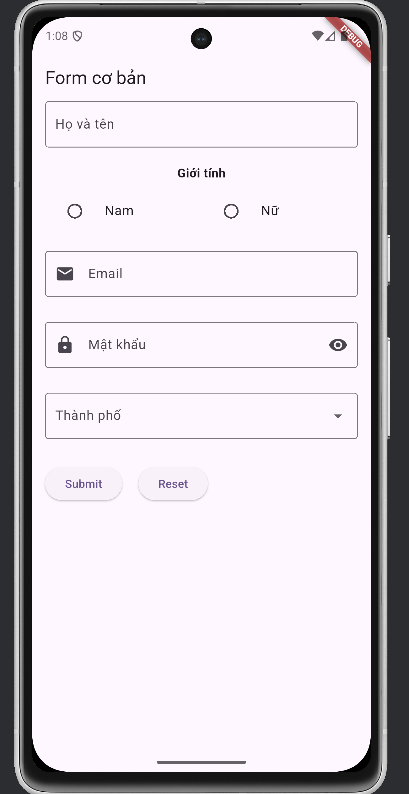
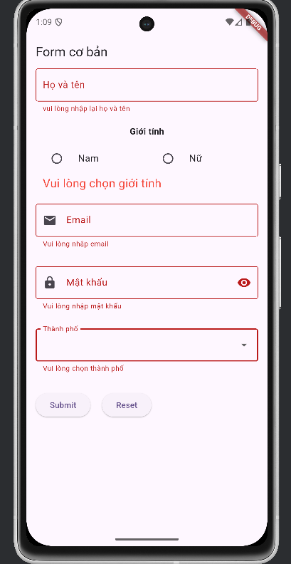
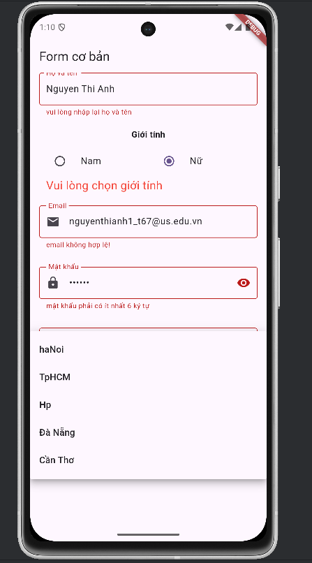

# Giới thiệu về Ứng dụng Form Đăng ký bằng Flutter

## Tổng quan
Ứng dụng này là một form đăng ký cơ bản được phát triển bằng **Flutter**, một framework đa nền tảng phổ biến do Google phát triển. Form này được thiết kế với giao diện đơn giản, thân thiện với người dùng trên thiết bị di động, sử dụng ngôn ngữ tiếng Việt.

## Tính năng chính
Form đăng ký bao gồm các tính năng sau:

- **Nhập thông tin người dùng**:
  - **Họ và tên**: Người dùng nhập họ và tên đầy đủ.
  - **Giới tính**: Lựa chọn giới tính (Nam hoặc Nữ) thông qua radio button.
  - **Email**: Trường nhập email với biểu tượng thư đi kèm.
  - **Mật khẩu**: Trường nhập mật khẩu với tùy chọn hiển thị/ẩn mật khẩu (biểu tượng con mắt).
  - **Thành phố**: Lựa chọn thành phố từ danh sách thả xuống (dropdown), ví dụ: TP.HCM, Hà Nội, Đà Nẵng, Cần Thơ.
 
    
  

- **Xác thực dữ liệu (Validation)**:
  - Hiển thị thông báo lỗi khi người dùng bỏ trống các trường bắt buộc, chẳng hạn:
    - "Vui lòng nhập họ và tên"
    - "Email không hợp lệ!" (nếu email không đúng định dạng)
    - "Mật khẩu phải có ít nhất 6 ký tự"
    - "Vui lòng chọn thành phố"
      
     

- **Nút điều khiển**:
  - **Submit**: Gửi thông tin form sau khi điền đầy đủ và hợp lệ.
  - **Reset**: Xóa toàn bộ dữ liệu đã nhập để bắt đầu lại.
 
     

## Giao diện
Ứng dụng có giao diện tối giản với tông màu sáng (nền hồng nhạt), phù hợp với thiết bị di động. Các trường nhập liệu được bố trí rõ ràng, đi kèm với các thông báo lỗi màu đỏ để người dùng dễ dàng nhận biết khi nhập sai.

## Mục đích
Form đăng ký này có thể được sử dụng trong các ứng dụng cần thu thập thông tin cơ bản từ người dùng, chẳng hạn như ứng dụng quản lý sinh viên, đăng ký tài khoản, hoặc các dịch vụ trực tuyến. Đây là một ví dụ cơ bản nhưng có thể được mở rộng thêm với các tính năng như:
- Kết nối với backend để lưu trữ dữ liệu.
- Thêm các trường nhập liệu khác (số điện thoại, ngày sinh, v.v.).
- Tùy chỉnh giao diện và cải thiện trải nghiệm người dùng.

## Công nghệ sử dụng
- **Flutter**: Framework chính để xây dựng ứng dụng.
- **Dart**: Ngôn ngữ lập trình được sử dụng trong Flutter.
- **Widgets cơ bản**: Sử dụng các widget như `TextField`, `Radio`, `DropdownButton`, và `ElevatedButton` để xây dựng form.

Ứng dụng này là một ví dụ tốt để học cách xây dựng form và xử lý dữ liệu người dùng trong Flutter.
